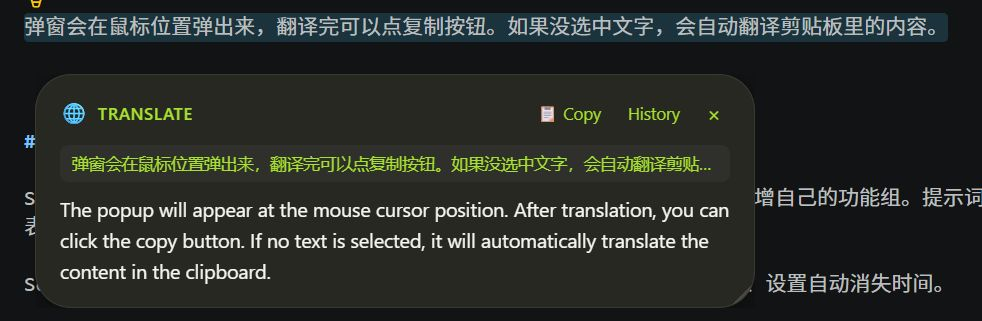
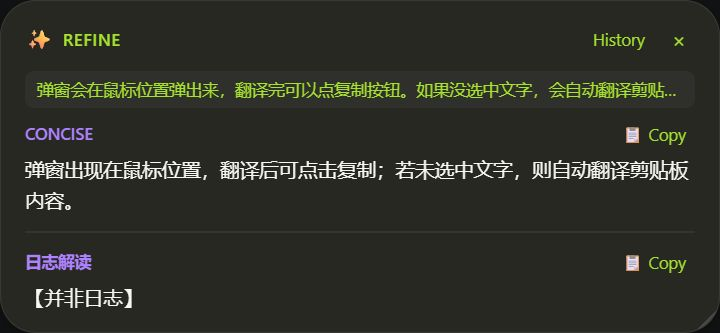
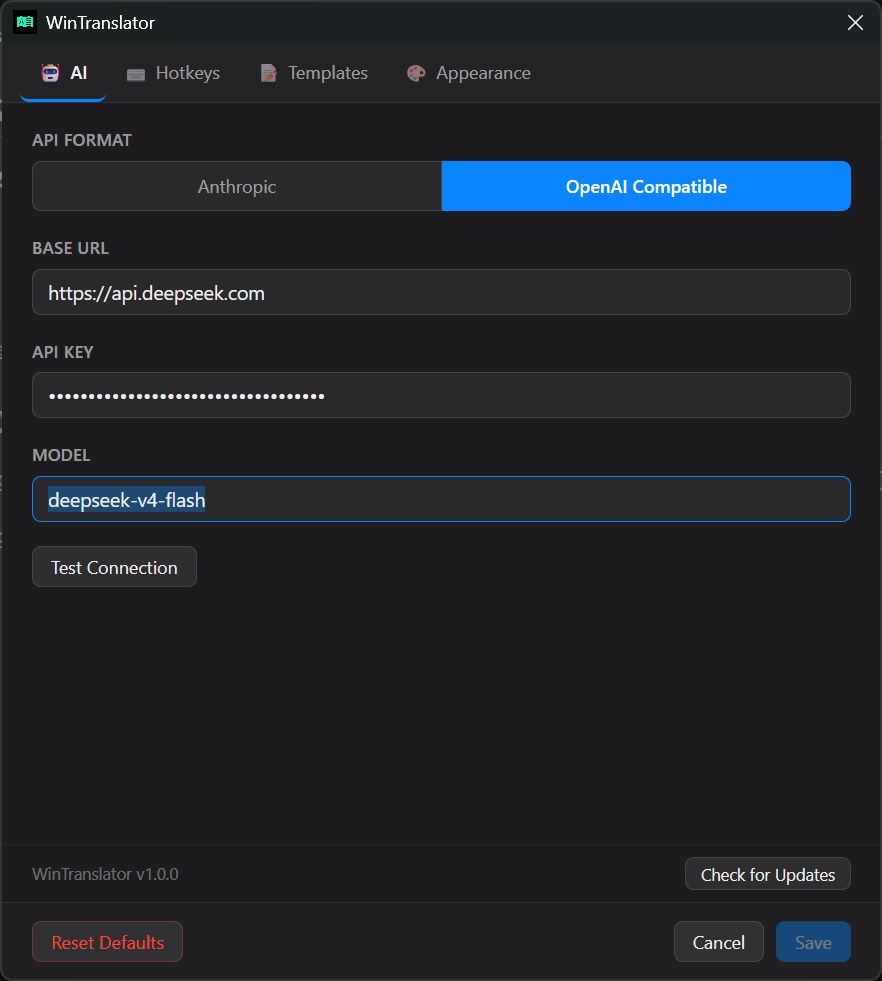

# WinTranslator


选中文字，按快捷键，弹窗直接出翻译结果。  
支持自定义prompt和快捷键，根据自己的需求设置不同的AI分析组合（不只局限于翻译领域）。

bilibili视频教程 https://www.bilibili.com/video/BV1xnji6pEzj

## 安装 / 运行

### Windows

在右侧的 release 页面中下载运行 `WinTranslator Setup 1.0.0.exe` 安装。

启动程序后右下角托盘会出现一个图标，说明已经在后台运行了。

### macOS

本地开发运行：

```bash
npm install
npm run dev
```

本地打包 DMG/ZIP：

```bash
npm run build:mac
```

首次使用选中文字捕获时，需要给应用授予辅助功能权限：

`System Settings` → `Privacy & Security` → `Accessibility` → 添加并启用 WinTranslator。

当前 macOS 包是 unsigned 本地包，没有做 Apple Developer ID 签名和公证。如果系统拦截启动，可以在 Finder 中右键应用选择 `Open`，或到 `System Settings` → `Privacy & Security` 中允许打开。


## 怎么用

**选中文字 → 按快捷键 → 看结果。** 就这么简单。

- `Alt + T`（macOS 上是 `Option + T`）— 翻译 -translate（中英文自动互译）
- `Alt + R`（macOS 上是 `Option + R`）— 润色 -refine（同时给出两种改写风格）
- `Esc` — 关掉弹窗

弹窗会在鼠标位置弹出来，翻译完可以点复制按钮。如果没选中文字，会自动翻译剪贴板里的内容。





## 配置 API Key

第一次使用需要先配一个 AI 接口的 Key，推荐用 DeepSeek，便宜好用。

### 获取 DeepSeek API Key

1. 打开 [https://platform.deepseek.com](https://platform.deepseek.com)，注册/登录
2. 左侧菜单点 **API Keys**
3. 点 **创建 API Key**，复制保存好（只显示一次）
4. 左侧菜单点 **充值**，充个几块钱就够用很久

### 在 WinTranslator 里填写

右键托盘图标 → 点 **Settings** → **AI** 标签页：

- **Provider**：选 `OpenAI Compatible`
- **Base URL**：填 `https://api.deepseek.com`
- **API Key**：粘贴你刚才复制的 Key
- **Model**：填 `deepseek-v4-flash`

点 **Test Connection**，显示成功就可以用了。




### 自定义功能

Settings → **Functions** 标签页可以：修改快捷键、编辑翻译提示词、新增自己的功能组。提示词里用 `{text}` 代表选中的文字。

Settings → **Appearance** 标签页可以：换主题、调透明度、改圆角大小、设置自动消失时间。

参考 [functions.md](functions.md) 里的示例.
